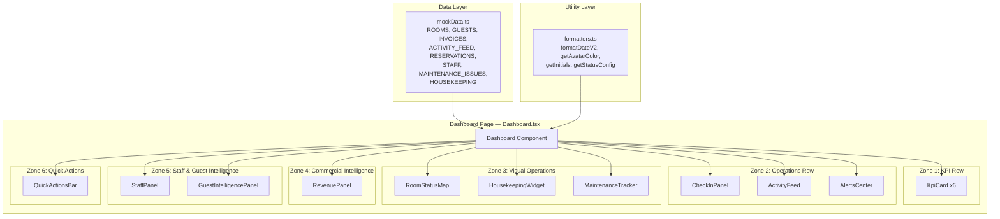
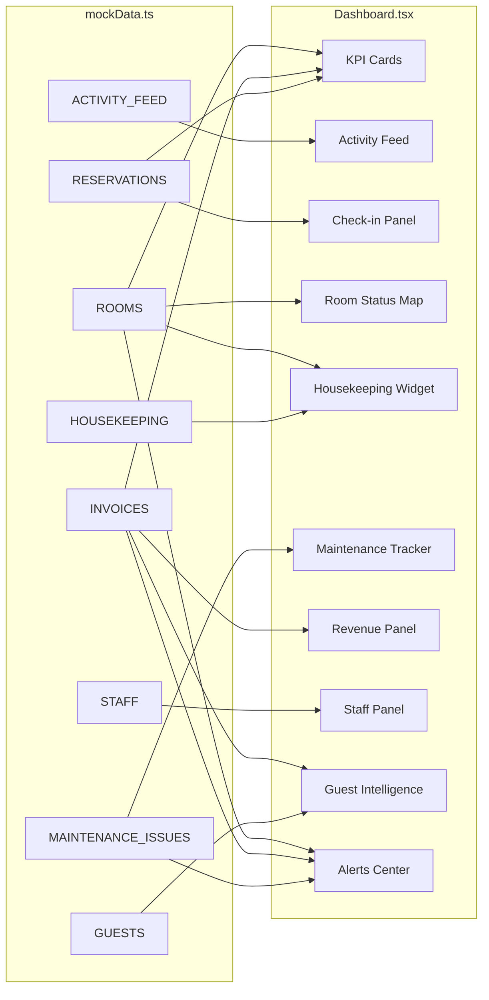

# Design Document: Dashboard Command Center

## Overview

This design transforms the existing minimal Dashboard page (4 stat cards) into a full operational command center for the Grand Vista Hotel. The command center consolidates 10+ widgets across 6 visual zones into a single scrollable page. All data is client-side mock data — no backend integration.

The implementation builds on the existing React + TypeScript + Vite stack, reuses the CSS design system (`src/index.css` variables, `src/styles/modules.css` shared classes), and follows the component patterns established by Rooms, Reservations, Billing, Staff, and Guests pages.

Key design decisions:
- **Single-file Dashboard**: All widget components are defined within `Dashboard.tsx` as local components (not separate files), keeping the feature self-contained and matching the existing page pattern where each page is a single file.
- **Mock data extension**: New arrays are added to `src/data/mockData.ts` alongside existing exports. Cross-referencing between arrays uses consistent room IDs and guest names.
- **CSS in Dashboard.css**: All new widget styles go in `Dashboard.css`, replacing the current leftover styles. The file uses design system variables exclusively.
- **No new dependencies**: Only `lucide-react` icons, `react-router-dom` navigation, and existing utilities from `src/utils/formatters.ts`.

## Architecture



### Layout Grid Structure

Each zone is a row within the `module-page` flex column. Within each zone, widgets are arranged using CSS Grid:

| Zone | Layout | Columns |
|------|--------|---------|
| 1 — KPI Row | `grid-template-columns: repeat(6, 1fr)` | 6 equal cards |
| 2 — Operations Row | `grid-template-columns: 1fr 1fr 1fr` | 3 equal panels |
| 3 — Visual Operations | `grid-template-columns: 1fr 1fr 1fr` | 3 equal panels |
| 4 — Commercial Intelligence | `grid-template-columns: 1fr` | Full width |
| 5 — Staff & Guest | `grid-template-columns: 1fr 1fr` | 2 equal panels |
| 6 — Quick Actions | `flex` row with `gap` | Horizontal button bar |

## Components and Interfaces

All components below are local to `Dashboard.tsx` (not exported). The Dashboard component itself is the only export.

### KpiCard

```typescript
interface KpiCardProps {
  label: string;
  value: string | number;
  icon: React.ReactNode;
  iconBg: string;
  iconColor: string;
  subtitle?: string; // e.g. "3 Std · 2 Dlx · 1 Ste" or "$360 outstanding"
}
```

A compact metric card. Renders using the `stat-card` CSS class with an added icon box. The subtitle line provides sub-breakdowns (room type counts, outstanding amounts).

### ActivityFeed

```typescript
interface ActivityEntry {
  id: number;
  type: 'check-in' | 'check-out' | 'payment' | 'maintenance';
  message: string;
  time: string;
}
```

Displays a filterable list of today's events. Local state `filter` controls which category is shown. Uses `filter-pill` classes for the category tabs. Each entry renders an icon (mapped from `type`), the message, and the time.

### CheckInPanel

```typescript
// Uses RESERVATIONS from mockData
// Filters: status === 'Confirmed' || status === 'Pending', checkin >= today
```

Renders a list of upcoming arrivals. Each row shows guest avatar (via `avatar-cell`), guest name, room type, check-in date, and a `pill-status` chip. A "View" button navigates to `/reservations`.

### RoomStatusMap

```typescript
// Uses ROOMS from mockData, grouped by floor
// Color mapping: Available → --status-green, Occupied → --status-rose,
//                Reserved → --status-amber, Maintenance → --text-light
```

Groups rooms by `floor` field. Each floor section has a header label. Room tiles are small colored squares showing the room number. Occupied rooms show guest initials. A legend row at the bottom maps colors to statuses.

### HousekeepingWidget

```typescript
interface HousekeepingEntry {
  room: string;
  status: 'Ready' | 'Awaiting Cleaning' | 'In Progress' | 'Not Ready';
  priority: boolean;
}
```

Displays four count cards (using `stat-card` pattern) for each housekeeping status. Below the counts, priority items (reserved rooms not ready) are listed with a warning indicator.

### MaintenanceTracker

```typescript
interface MaintenanceIssue {
  id: string;
  room: string;
  issue: string;
  priority: 'High' | 'Medium' | 'Low';
  reportedAt: string;
  status: 'Open' | 'In Progress' | 'Resolved';
}
```

Shows a summary header (open count, blocked rooms count) and a list of open issues. High priority items use `--status-rose` color. Each entry shows room number, issue description, priority pill, and time reported.

### RevenuePanel

```typescript
// Derives from INVOICES in mockData
// Computes: revenueToday, revenueMonth, outstandingAmount, billingHealth%
```

Three summary figures at the top. Below, two mini-lists: recent payments (Paid invoices) and outstanding invoices (Pending). Uses `pill-status` for Paid/Pending indicators.

### StaffPanel

```typescript
// Uses STAFF from mockData, filters status === 'On Duty', groups by role
```

Groups on-duty staff by role. Each role section shows a header with role name and count. Staff entries use `avatar-cell` pattern. Roles with zero on-duty staff show a warning badge.

### GuestIntelligencePanel

```typescript
// Uses GUESTS and INVOICES from mockData
// VIP/Repeat: stays >= 3
// Unpaid: guest name matches a Pending invoice
```

Three sections: VIP/Repeat Guests, Guests with Unpaid Balances, Recent Guest Activity. Each guest entry shows avatar, name, stays, total spent, and outstanding balance if applicable.

### AlertsCenter

```typescript
interface Alert {
  id: string;
  severity: 'critical' | 'warning';
  message: string;
  reference: string; // room or guest ID
}
```

Derives alerts by cross-referencing mock data:
- Reserved rooms under maintenance → critical
- Pending invoices past expected date → warning
- Maintenance reducing available inventory → warning

Sorted by severity (critical first). Uses `--status-rose` for critical, `--status-amber` for warning.

### QuickActionsBar

```typescript
// Array of { label, icon, path } objects
// onClick navigates via useNavigate()
```

Horizontal row of shortcut buttons. Each button has an icon + label. Navigation targets:
- New Reservation → `/reservations`
- Check In Guest → `/reservations`
- Check Out Guest → `/reservations`
- Mark Invoice Paid → `/billing`
- Report Maintenance → `/rooms`

## Data Models

### Mock Data Extensions to `src/data/mockData.ts`

The following new exports are added alongside existing `ROOMS`, `GUESTS`, `INVOICES`, `ACTIVITY_FEED`:

#### RESERVATIONS

```typescript
export const RESERVATIONS = [
  { id: 'RES-001', guest: 'Alice Cooper', room: '102', checkin: '2026-04-06', checkout: '2026-04-09', total: 360, status: 'Checked-in', paymentStatus: 'Paid' },
  { id: 'RES-002', guest: 'Bob Smith', room: '301', checkin: '2026-04-03', checkout: '2026-04-06', total: 840, status: 'Checked-out', paymentStatus: 'Paid' },
  { id: 'RES-003', guest: 'Charlie Day', room: '103', checkin: '2026-04-10', checkout: '2026-04-12', total: 360, status: 'Confirmed', paymentStatus: 'Pending' },
  { id: 'RES-004', guest: 'Emma Wilson', room: '105', checkin: '2026-04-15', checkout: '2026-04-20', total: 1400, status: 'Confirmed', paymentStatus: 'Pending' },
  { id: 'RES-005', guest: 'David Patel', room: '201', checkin: '2026-04-05', checkout: '2026-04-07', total: 550, status: 'Checked-in', paymentStatus: 'Paid' },
  { id: 'RES-006', guest: 'Sarah Connor', room: '405', checkin: '2026-04-18', checkout: '2026-04-22', total: 920, status: 'Pending', paymentStatus: 'Pending' },
];
```

#### STAFF (moved from inline in Staff.tsx)

```typescript
export const STAFF = [
  { id: 'STF-01', name: 'James Wilson', role: 'Front Desk', shift: 'Morning', status: 'On Duty', rating: 4.9, email: 'james.w@grandvista.com' },
  { id: 'STF-02', name: 'Maria Garcia', role: 'Housekeeping', shift: 'Afternoon', status: 'Off Duty', rating: 4.7, email: 'maria.g@grandvista.com' },
  { id: 'STF-03', name: 'Robert Chen', role: 'Concierge', shift: 'Morning', status: 'On Duty', rating: 4.8, email: 'robert.c@grandvista.com' },
  { id: 'STF-04', name: 'Sarah Miller', role: 'Security', shift: 'Night', status: 'On Duty', rating: 4.9, email: 'sarah.m@grandvista.com' },
  { id: 'STF-05', name: 'David Jones', role: 'Front Desk', shift: 'Afternoon', status: 'Off Duty', rating: 4.6, email: 'david.j@grandvista.com' },
];
```

#### MAINTENANCE_ISSUES

```typescript
export const MAINTENANCE_ISSUES = [
  { id: 'MNT-001', room: '105', issue: 'AC unit not cooling', priority: 'High', reportedAt: '08:00 AM', status: 'Open' },
  { id: 'MNT-002', room: '304', issue: 'Leaking bathroom faucet', priority: 'Medium', reportedAt: '09:30 AM', status: 'In Progress' },
  { id: 'MNT-003', room: '202', issue: 'TV remote not working', priority: 'Low', reportedAt: '11:15 AM', status: 'Open' },
];
```

#### HOUSEKEEPING

```typescript
export const HOUSEKEEPING = [
  { room: '101', status: 'Ready', priority: false },
  { room: '102', status: 'Awaiting Cleaning', priority: false },
  { room: '103', status: 'Not Ready', priority: true },
  { room: '104', status: 'Ready', priority: false },
  { room: '201', status: 'In Progress', priority: false },
  { room: '202', status: 'Ready', priority: false },
  { room: '203', status: 'Awaiting Cleaning', priority: false },
  { room: '204', status: 'Not Ready', priority: true },
  { room: '301', status: 'Awaiting Cleaning', priority: false },
  { room: '302', status: 'Ready', priority: false },
];
```

#### Extended ACTIVITY_FEED (replace existing 3 entries with 8+)

```typescript
export const ACTIVITY_FEED = [
  { id: 1, type: 'check-in', message: 'Alice Cooper checked into Room 102', time: '10:45 AM' },
  { id: 2, type: 'payment', message: 'Payment received for INV-1002 — $840', time: '09:30 AM' },
  { id: 3, type: 'maintenance', message: 'Room 105 marked for maintenance — AC unit', time: '08:15 AM' },
  { id: 4, type: 'check-out', message: 'Bob Smith checked out of Room 301', time: '11:00 AM' },
  { id: 5, type: 'check-in', message: 'David Patel checked into Room 201', time: '02:15 PM' },
  { id: 6, type: 'payment', message: 'Payment received for INV-1003 — $550', time: '02:30 PM' },
  { id: 7, type: 'maintenance', message: 'Room 304 — leaking faucet reported', time: '03:00 PM' },
  { id: 8, type: 'check-out', message: 'Guest departed Room 203', time: '12:00 PM' },
];
```

#### Extended GUESTS (from 3 to 6+)

```typescript
export const GUESTS = [
  { id: 'g1', name: 'Alice Cooper', email: 'alice@example.com', phone: '+1 555-0101', stays: 6, totalSpent: 2450 },
  { id: 'g2', name: 'Bob Smith', email: 'bob@example.com', phone: '+1 555-0102', stays: 2, totalSpent: 450 },
  { id: 'g3', name: 'Charlie Day', email: 'charlie@exam.com', phone: '+1 555-0103', stays: 1, totalSpent: 180 },
  { id: 'g4', name: 'Emma Wilson', email: 'emma@example.com', phone: '+1 555-0104', stays: 4, totalSpent: 3200 },
  { id: 'g5', name: 'David Patel', email: 'david@example.com', phone: '+1 555-0105', stays: 3, totalSpent: 1650 },
  { id: 'g6', name: 'Sarah Connor', email: 'sarah@example.com', phone: '+1 555-0106', stays: 1, totalSpent: 0 },
];
```

#### Extended INVOICES (from 2 to 6+)

```typescript
export const INVOICES = [
  { id: 'INV-1001', guest: 'Alice Cooper', room: '102', amount: 360, status: 'Pending', date: '2026-04-06' },
  { id: 'INV-1002', guest: 'Bob Smith', room: '301', amount: 840, status: 'Paid', date: '2026-04-03' },
  { id: 'INV-1003', guest: 'David Patel', room: '201', amount: 550, status: 'Paid', date: '2026-04-05' },
  { id: 'INV-1004', guest: 'Emma Wilson', room: '105', amount: 1400, status: 'Pending', date: '2026-04-15' },
  { id: 'INV-1005', guest: 'Charlie Day', room: '103', amount: 360, status: 'Pending', date: '2026-04-10' },
  { id: 'INV-1006', guest: 'Sarah Connor', room: '405', amount: 920, status: 'Pending', date: '2026-04-18' },
];
```

### Data Flow



### CSS Architecture

`Dashboard.css` is rewritten (replacing leftover styles) with these class groups:

| Class Prefix | Purpose |
|---|---|
| `.dash-zone-*` | Zone row containers (kpi, operations, visual, commercial, staff-guest, actions) |
| `.dash-kpi-row` | 6-column grid for KPI cards |
| `.dash-kpi-card` | Extended stat-card with icon box |
| `.dash-widget` | Base widget card (white bg, border, radius, shadow) |
| `.dash-widget-header` | Widget title bar with label + optional count badge |
| `.dash-feed-*` | Activity feed entry styles |
| `.dash-room-grid` | Room tile grid within each floor |
| `.dash-room-tile` | Individual room tile (colored square) |
| `.dash-legend` | Room status legend row |
| `.dash-hk-counts` | Housekeeping 4-count grid |
| `.dash-mnt-*` | Maintenance tracker entry styles |
| `.dash-revenue-*` | Revenue panel summary + lists |
| `.dash-alert-*` | Alert entry styles |
| `.dash-actions` | Quick actions bar layout |

All colors reference `var(--status-*)`, `var(--text-*)`, `var(--border-*)`, `var(--bg-*)` from `index.css`. Border radius uses `var(--radius-lg)` and `var(--radius-sm)`. Shadows use `var(--shadow-card)`.


## Correctness Properties

*A property is a characteristic or behavior that should hold true across all valid executions of a system — essentially, a formal statement about what the system should do. Properties serve as the bridge between human-readable specifications and machine-verifiable correctness guarantees.*

### Property 1: Room status aggregation

*For any* array of room objects with valid status fields, the computed occupancy rate should equal `(count where status === 'Occupied') / totalRooms * 100`, the available count should equal `count where status === 'Available'`, and the per-type breakdown of available rooms should sum to the total available count.

**Validates: Requirements 1.2, 1.3**

### Property 2: Reservation date-based filtering

*For any* array of reservation objects and any reference date, the "arrivals today" count should equal the number of reservations where `checkin === referenceDate` and `status` is "Confirmed" or "Pending", and the "departures today" count should equal the number of reservations where `checkout === referenceDate` and `status` is "Checked-in".

**Validates: Requirements 1.4, 1.5**

### Property 3: Invoice aggregation

*For any* array of invoice objects and any reference date, "revenue today" should equal the sum of amounts where `status === 'Paid'` and `date === referenceDate`, "pending count" should equal the count where `status === 'Pending'`, and "outstanding amount" should equal the sum of amounts where `status === 'Pending'`.

**Validates: Requirements 1.6, 1.7**

### Property 4: Activity feed filtering

*For any* array of activity entries and any selected filter category, when the category is not "All", the filtered result should contain only entries whose `type` matches the category mapping, and when the category is "All", the filtered result should equal the original array.

**Validates: Requirements 2.4, 2.5**

### Property 5: Check-in panel filtering

*For any* array of reservation objects and any reference date, the check-in panel list should contain only reservations where `status` is "Confirmed" or "Pending" and `checkin >= referenceDate`, and every entry in the result should satisfy both conditions.

**Validates: Requirements 3.1, 3.2, 3.3**

### Property 6: Room floor grouping

*For any* array of room objects, grouping by floor should produce groups where every room in a group has the same floor value, and the union of all groups should equal the original set of rooms (no rooms lost or duplicated).

**Validates: Requirements 4.1, 4.2**

### Property 7: Room status color mapping

*For any* room status string from the set {Available, Occupied, Reserved, Maintenance}, the color mapping function should return a deterministic color value: green for Available, rose for Occupied, amber for Reserved, gray for Maintenance.

**Validates: Requirements 4.3**

### Property 8: Housekeeping status counting

*For any* array of housekeeping entries, the sum of counts across all four categories (Ready, Awaiting Cleaning, In Progress, Not Ready) should equal the total number of entries, and the priority items list should contain exactly those entries where `priority === true`.

**Validates: Requirements 5.1, 5.3**

### Property 9: Maintenance issue filtering and summary

*For any* array of maintenance issues and any array of rooms, the displayed list should contain only issues with status "Open" or "In Progress", the open count should match, and the "blocked rooms" count should equal the number of rooms whose ID appears in an open maintenance issue.

**Validates: Requirements 6.1, 6.3**

### Property 10: Revenue and billing health computation

*For any* array of invoices, the billing health percentage should equal `(sum of Paid amounts) / (sum of all amounts) * 100`, the recent payments list should contain only invoices with status "Paid", and the outstanding list should contain only invoices with status "Pending".

**Validates: Requirements 7.1, 7.2, 7.3, 7.4**

### Property 11: Staff grouping and coverage detection

*For any* array of staff objects and a known set of roles, the on-duty list should contain only staff with `status === 'On Duty'`, the per-role count should match the grouped data, and any role from the known set with zero on-duty staff should be flagged as a coverage gap.

**Validates: Requirements 8.1, 8.3, 8.4**

### Property 12: Repeat guest identification

*For any* array of guest objects, the repeat/VIP guest list should contain exactly those guests where `stays >= 3`, and no guest with `stays < 3` should appear in the list.

**Validates: Requirements 9.2**

### Property 13: Guest unpaid balance cross-referencing

*For any* array of guest objects and any array of invoices, a guest should appear in the "unpaid balances" list if and only if there exists at least one invoice with `status === 'Pending'` whose `guest` field matches the guest's `name`.

**Validates: Requirements 9.3**

### Property 14: Alert generation and severity ordering

*For any* combination of rooms, maintenance issues, and invoices, the alerts list should contain a critical alert for every room that is both "Reserved" and has an open maintenance issue, a warning alert for maintenance issues reducing inventory, and the resulting list should be sorted with all critical alerts before all warning alerts.

**Validates: Requirements 10.2, 10.4**

### Property 15: Quick action navigation mapping

*For any* quick action configuration object with a `label` and `path`, invoking the action's handler should trigger navigation to the specified `path`.

**Validates: Requirements 11.2, 11.3, 11.4, 11.5, 11.6**

### Property 16: Mock data cross-referential consistency

*For any* reservation in RESERVATIONS, the `room` field should reference a valid room ID in ROOMS. *For any* invoice in INVOICES, the `guest` field should match a `name` in GUESTS. *For any* housekeeping entry, the `room` field should reference a valid room ID in ROOMS.

**Validates: Requirements 13.8**

## Error Handling

Since this is a client-side dashboard with static mock data, error scenarios are limited. The following defensive patterns apply:

| Scenario | Handling |
|---|---|
| Empty data arrays | Widgets render gracefully with zero counts and empty lists. No crashes on `.filter()`, `.reduce()`, or `.map()` over empty arrays. |
| Division by zero (occupancy rate, billing health) | Guard with `totalRooms === 0 ? 0 : ...` and `totalAmount === 0 ? 0 : ...` to avoid NaN. |
| Missing cross-references | If a reservation references a room ID not in ROOMS, the room type displays as "Unknown". If a guest name doesn't match GUESTS, the avatar falls back to default initials. |
| No matching filter results | Activity feed and check-in panel show an empty state message ("No events" / "No upcoming check-ins") rather than a blank area. |
| Date comparison edge cases | All date comparisons use string equality on `YYYY-MM-DD` format to avoid timezone issues, consistent with the existing `formatDateV2` utility pattern. |

## Testing Strategy

### Unit Tests

Unit tests cover specific examples and edge cases:

- KPI cards render correct values with the default mock data
- Activity feed shows all 8 entries when "All" filter is selected
- Activity feed shows only check-in entries when "Check-ins" filter is selected
- Check-in panel excludes past reservations and checked-out reservations
- Room status map renders correct number of floor sections (3 floors)
- Housekeeping widget shows correct counts for default mock data
- Maintenance tracker shows summary with correct open count
- Revenue panel computes correct billing health percentage
- Staff panel groups on-duty staff correctly
- Guest intelligence identifies Alice Cooper and Emma Wilson as repeat guests (stays >= 3)
- Alerts center generates critical alert for room 105 (Reserved + Maintenance conflict in mock data)
- Quick action buttons render with correct labels and icons
- Division by zero guards return 0 instead of NaN
- Empty data arrays produce zero counts without errors

### Property-Based Tests

Property-based tests use `fast-check` (the standard PBT library for TypeScript/JavaScript) to verify universal properties across randomly generated inputs. Each property test runs a minimum of 100 iterations.

Each test is tagged with a comment referencing the design property:
```
// Feature: dashboard-command-center, Property {N}: {title}
```

The computation logic for KPIs, filtering, grouping, and alert generation should be extracted into pure helper functions (e.g., `computeOccupancyRate(rooms)`, `filterActivityFeed(entries, category)`, `groupRoomsByFloor(rooms)`, `generateAlerts(rooms, issues, invoices)`) to enable direct property-based testing without DOM rendering.

Properties to implement:
1. Room status aggregation (Property 1)
2. Reservation date-based filtering (Property 2)
3. Invoice aggregation (Property 3)
4. Activity feed filtering (Property 4)
5. Check-in panel filtering (Property 5)
6. Room floor grouping (Property 6)
7. Room status color mapping (Property 7)
8. Housekeeping status counting (Property 8)
9. Maintenance issue filtering and summary (Property 9)
10. Revenue and billing health computation (Property 10)
11. Staff grouping and coverage detection (Property 11)
12. Repeat guest identification (Property 12)
13. Guest unpaid balance cross-referencing (Property 13)
14. Alert generation and severity ordering (Property 14)
15. Quick action navigation mapping (Property 15)
16. Mock data cross-referential consistency (Property 16)

Each correctness property is implemented by a single property-based test. Unit tests complement these by covering specific examples, edge cases (empty arrays, division by zero), and integration points (DOM rendering, navigation).
